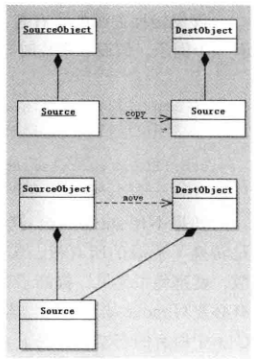

# 左值与右值

## 一、左值、右值与右值引用

在 C++11 中所有的值必属于左值、将亡值、纯右值三者之一。左值是指表达式结束后依然存在的持久化对象，右值是指表达式结束时就不再存在的临时对象。所有的具名变量或者对象都是左值，而右值不具名。区分左值和右值的方法：**看能不能对表达式取地址**，如果能，则为左值，否则为右值。

在 C++11 中，右值分为将亡值和纯右值，比如，非引用返回的临时变量、运算表达式产生的临时变量、原始字面量和 lambda 表达式等都是纯右值。而将亡值是 C++11 新增的、与右值引用相关的表达式，比如，将要被移动的对象、T&& 函数返回值、std::move 返回值和转换为 T&& 的类型的转换函数的返回值等。

```c++
class Foo
{
public:
    Foo(int a) 
        : a_(a)
    {}

private:
    int a_;
};

Foo getFoo()
{
    return Foo(10);
}

int main()
{
    int i = 0;  // i是左值，0是右值
    Foo tmp = getFoo();  // tmp是左值，getTest()的返回值是右值(临时变量)
}
```

**左值引用**就是给变量取个别名，如 int& 是对左值进行绑定（但是 int& 却不能绑定右值）

```c++
int nTmp = 10;
int &refTmp = nTmp;
int &refNum = 1;  // error
```

**右值引用**就是对一个右值进行引用。语法是 A&&，通过’&&’来表示绑定类型为 A 的右值。右值引用其实就是延长右值临时变量的生命周期，只要该右值引用变量存在，该临时右值变量则会一直存在。

无论是声明一个左值引用还是右值引用，都**必须立即进行初始化**。而其原因可以理解为是引用类型本身自己并不拥有所绑定对象的内存，只是该对象的一个别名。左值引用是具名变量值的别名，而右值引用则是不具名（匿名）变量的别名。

```c++
int&& i = 0;
int b = 1;
int&& c = b;  // 错误，右值引用是不能绑定任何左值的
Foo&& tmp = getFoo();
const Foo& f = getFoo();
Foo tt = getFoo();
```

最后一行代码会产生两种类型的值，一种是左值 tt，一种是函数 getTest() 返回的临时值，这个临时值在表达式结束后就销毁了，而左值 tmp 在表达式结束后仍然存在，这个临时值就是右值。

**常量左值在 C++ 中是个“万能”的引用类型**，它可以接收非常量左值、常量左值、右值进行初始化。而且在使用右值对其初始化的时候，常量左值引用还可以像右值引用一样将右值的生命期延长。

引入右值解决两个问题，**第一个问题就是临时对象非必要的昂贵的拷贝操作，第二个问题是在模板函数中如何按照参数的实际类型进行转发。**

C++ 中引入右值引用和移动语义，可以避免无谓的复制，提高程序性能。

```c++
#include <iostream>

class Foo
{
public:
    Foo() 
    {
        std::cout << "construct:" << ++s_constructCount << std::endl; 
    }

    ~Foo() 
    {
        std::cout << "destruct:" << ++s_destructCount << std::endl;
    }

    Foo(const Foo &rhs)
    {
        std::cout << "copy construct:" << ++s_copyConstructCount << std::endl;
    }

    static uint32_t s_constructCount;
    static uint32_t s_destructCount;
    static uint32_t s_copyConstructCount;
};

uint32_t Foo::s_constructCount = 0;
uint32_t Foo::s_destructCount = 0;
uint32_t Foo::s_copyConstructCount = 0;

Foo getFoo()
{
    return Foo();
}

int main()
{
    Foo tmp = getFoo();
    return 0;
}
```

当 GCC 使用编译参数 -fno-elide-constructors 关闭返回值优化，会有以下输出结果：


从结果中可以看到，拷贝构造函数调用了两次，一次是 getFoo() 函数内部创建的对象返回出来构造一个临时对象产生的，另一次是在 main 函数中构造 tmp 对象产生的。第二次的 destruct 是因为临时对象在构造 tmp 对象之后就销毁了。

```c++
int main()
{
    Foo&& tmp = getFoo();
    return 0;
}
```

getFoo() 返回的右值本应该在表达式语句结束后，其生命也就结束了（因为是临时变量），而通过右值引用，该右值又重获新生，其生命期将与右值引用类型变量 tmp 的生命期一样，只要 tmp 还活着，该右值临时变量将会一直存活下去。实际上就是给那个临时变量取了个名字。


通过右值引用，比之前少了一次拷贝构造和一次析构，原因在于右值引用绑定了右值，让临时右值的生命周期延长了。可以利用这个特点做一些性能优化，即避免临时对象的拷贝构造和析构，事实上，在 C++98/03 中，通过常量左值引用也经常用来做性能优化。

```c++
const Foo&& tmp = getFoo();
```

左值引用只能绑定左值，右值引用只能绑定右值，如果绑定的不对，编译就会失败。但是，有个特殊的，**常量左值引用**，它可以算是一个“万能”的引用类型，它可以绑定非常量左值、常量左值、右值，而且在绑定右值的时候，常量左值引用还可以像右值引用一样将右值的生命期延长，缺点是，只能读不能改。

输出结果和右值引用一样。

## 二、右值引用

T&& 并不是表示右值，有可能表示左值，也有可能表示右值。但是 T&& 必须被初始化，被右值初始化就是右值，被左值初始化就是左值。

```c++
#include <string>
#include <vector>
#include <iostream>

void reference(std::string& str)
{
    std::cout << "左值" << std::endl;
}

void reference(std::string&& str) 
{
    std::cout << "右值" << std::endl;
}

int main()
{
    std::string lv1 = "string,";  // lv1 是一个左值

    std::string&& rv1 = std::move(lv1);  // 合法, std::move 可以将左值转移为右值

    std::cout << "rv1 = " << rv1 << std::endl;  // string,

    std::cout << "lv1 = " << lv1 << std::endl;  // string, 并没有将lv1的值转移

    const std::string& lv2 = lv1 + lv1;  // 合法, 常量左值引用能够延长临时变量的生命周期(字面值)
    // lv2 += "Test";  // 非法, const 无法被修改

    std::cout << "lv2 = " << lv2 << std::endl;  // string,string

    std::string&& rv2 = lv1 + lv2;  // 合法, 右值引用延长临时对象的生命周期
    rv2 += "string";  // 合法, 非常量引用能够修改临时变量

    std::cout << "rv2 = " << rv2 << std::endl;  // string,string,string,string

    std::vector<std::string> vec;
    vec.push_back(std::move(lv1));  // lv1的值转移, rv1的值也没有了, cout << lv1 << rv1; 均为空
    std::cout << lv1 << ' ' << rv1 << std::endl;  // ' '

    reference(lv1);  // 左值
    reference(rv1);  // 左值
    reference(rv2);  // 左值
    reference("string");  // 右值
}
```

编译器会将已经命名的右值引用视为左值，未命名的右值视为右值。

| 引用类型       | 可以引用的值类型 |          |            |          | 注记                     |
| -------------- | ---------------- | -------- | ---------- | -------- | ------------------------ |
|                | 非常量左值       | 常量左值 | 非常量右值 | 常量右值 |                          |
| 非常量左值引用 | Y                | N        | N          | N        | 无                       |
| 常量左值引用   | Y                | Y        | Y          | Y        | 全能类型，可用于拷贝语义 |
| 非常量右值引用 | N                | N        | Y          | N        | 用于移动语义、完美转发   |
| 常量右值引用   | N                | N        | Y          | Y        | 暂无用途                 |

标准库 <type_traits> 头文件中提供了3个模板类：**is_rvalue_reference**、**is_lvalue_reference**、**is_reference**，可判断一个类型是否是引用类型，以及是左值引用还是右值引用。如：`cout << is_rvalue_reference<string&&>::value`。

C++11 中折叠引用，其规则如下：

- 　　所有的右值引用叠加到右值引用还是右值引用；
- 　　所有的其他引用类型之间的叠加都变成左值引用。

## 三、移动语义

C++11 中可以将左值强制转换为右值，从而避免对象的拷贝来提升性能。move 将对象的状态或者所有权从一个对象转移到另一个对象，没有内存拷贝。深拷贝和 move 的区别如图：



从图可以看出，深拷贝会有两份内存，而 move 只有一份，move 只是将内存的所有者切换为目标对象，并没有移动任何东西，只是强制将左值转换为右值。

在 C++11 之前的拷贝构造函数和赋值函数要有如下定义：

```c++
// 赋值函数
T& T::operator=(const T& rhs)
{
    // 销毁内部资源
    // 复制rhs资源到自身
}

T getT(); // 假如 getT 是返回一个 T 类型的函数

T a;
a = getT();
```

a = getT() 将有如下动作：

1. 销毁 a 的资源；
2. 赋值 getT 返回的临时对象的资源；
3. 销毁临时对象，释放其资源。

其实可以优化的是，将 a 和临时对象的资源指针做交换，让临时对象去销毁 a 原来拥有的资源，a 拥有临时对象的资源指针。那么赋值操作函数就该这么写：

```
T &T::operator=(const T& rhs)
{
    //转移资源的控制权，无需复制
}
```

**C++11 提供了移动构造函数和移动赋值操作符，用于支持移动语义。**

```c++
#include <iostream>

class Foo
{
public:
    Foo(const Foo& rhs)
    {
        // 拷贝 rhs.str 的内容到 this.str 中
        // 需要深拷贝
        memcpy(str, rhs.str, 0);
    }
	// 移动构造函数
    Foo(Foo&& rhs)
    {
        // 夺取 rhs.str 的资源，并将 rhs.str 置空
        // 无需深拷贝
        str = rhs.str;
        rhs.str = nullptr;
    }

    Foo& operator=(const Foo& rhs)
    {
        // 释放 str
        // 拷贝 rhs.str 的内容到 this.str 中
        // 需要深拷贝
        // delete str;
        memcpy(str, rhs.str, 0);
        return *this;
    }
    // 移动赋值操作符
    Foo& operator=(Foo&& rhs)
    {
        // 释放 str
        // 夺取 rhs.str 的资源，并将 rhs.str 置空
        // 无需深拷贝
        return *this;
    }

private:
    char* str{ nullptr };
};
```

假如一个临时容器很大，要赋值给另一个容器。如果不用 move，拷贝的代价很大，性能较低，使用 move 几乎没有代价，只转换了资源的所有权。当然，当一个左值被 move 之后，不再对之前的内存有控制权，会被置为一个空对象。

### std::move

在 C++11 中，标准库在 \<utility> 中提供了一个有用的函数 std::move，该函数并不能移动任何东西，它唯一的功能是将一个左值强制转化为右值引用，继而可以通过右值引用使用该值，以用于移动语义。从实现上讲，std::move 基本等同于一个类型转换：

```c++
static_cast<T&&>(lvalue);
```

注意，被转化的左值，其生命期并没有随着左右值的转化而改变。

使用移动语义的前提是：**类对象需要添加一个以右值引用为参数的移动构造函数**，若没有声明移动构造函数，将调用以常量左值引用为参数的拷贝构造函数。这是一种非常安全的设计——移动不成，至少还可以执行拷贝。

在标准库的头文件 <type_traits> 里，可以通过模板类来判断一个类型是否是可以移动。比如 **is_move_constructible**、**is_trivially_move_constructible**、**is_nothrow_move_constructible**，使用方法仍然是使用其成员 value。比如：`cout << is_move_constructible<UnknownType>::value`。

## 四、完美转发

所谓完美转发，是指在函数模板中，完全依照模板的参数的类型，将参数传递给函数模板中调用的另外一个函数。

```c++
void foo(int&& i)
{
    foo2(i);
}

foo(5);  // 5在此时是右值，在 foo2 调用的时候就是左值
```

C++11 中折叠引用，其规则如下：

- 　　所有的右值引用叠加到右值引用还是右值引用；
- 　　所有的其他引用类型之间的叠加都变成左值引用。

C++11 提供了 **std::forward**，将参数传递给函数中调用的另一个函数，按照参数本来的类型转发。

```c++
#include <iostream>

void RunCode(int&& m)
{
    std::cout << "rvalue ref\n";
}
void RunCode(int& m)
{
    std::cout << "lvalue ref\n";
}
void RunCode(const int&& m)
{
    std::cout << "const rvalue ref\n";
}
void RunCode(const int& m)
{
    std::cout << "const lvalue ref\n";
}

template < typename T>
void PerfectForward(T&& t)
{
    RunCode(std::forward<T>(t));
}

int main()
{
    int a, b;
    const int c{ 1 }, d{ 0 };
    PerfectForward(a);  // lvalue ref
    PerfectForward(std::move(b));  // rvalue ref
    PerfectForward(c);  // const lvalue ref
    PerfectForward(std::move(d));  // const rvalue ref
}
```


