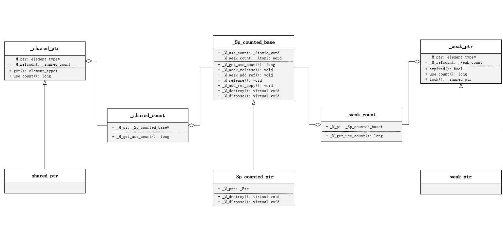

# 智能指针

C++11 引入了三种智能指针：

- `std::shared_ptr`
- `std::weak_ptr`
- `std::unique_ptr`

## 一、std::shared_ptr

`shared_ptr` 使用引用计数，每个 `shared_ptr` 的拷贝都指向相同的内存，在最后一个 `shared_ptr` 析构的时候，内存才会释放。

### 1. 基本用法

#### 1.1 初始化

`shared_ptr` 可以通过 `std::make_shared()` 来初始化，也可以直接构造 `shared_ptr<T>` 对象和 `reset()` 方法来初始化。智能指针的用法和普通指针的用法类似，不过不需要自己管理分配的内存，对于没有初始化的指针，只能通过 reset 来初始化；当智能指针有值，reset 会使计数器减 1。智能指针通过重载 bool 来判断是否为空。

```c++
#include <iostream>
#include <memory>

int main() 
{
	std::shared_ptr<int> p1 = std::make_shared<int>(10);
	std::shared_ptr<int> p2(new int(20));
	std::shared_ptr<int> p3 = p2;
	std::shared_ptr<int> p4;

	p4.reset(new int(30));

	if (p4) {
		std::cout << "p4:" << *p4 << std::endl;
	}
    return 0;
}
```

**智能指针不能通过原始指针来初始化**：

```c++
std::shared_ptr<int> p = new int(1); // 编译报错，不能直接赋值
```

#### 1.2 获取原始指针

当需要获取原始指针的时候，可以通过 `get()` 来返回原始指针。注意：**不能释放，如果释放会出错。**

```c++
std::shared_ptr<int> ptr(new int(1));
int *p = ptr.get();
delete p; // error
```

#### 1.3 指定删除器

智能指针支持指定删除器，在指针引用为 0 的时候自动调用。支持普通函数和 lambda 表达式。

```c++
#include <memory>

void deleteIntPtr(int *p) 
{
	delete p;
}

int main() 
{
	std::shared_ptr<int> p1(new int(10), deleteIntPtr);

	std::shared_ptr<int> p2(new int(20), [](int *p) {delete p; });
    return 0;
}
```

当智能指针管理动态数组的时候，**默认的删除器不支持数组对象**。需要指定删除器，自定义删除器或者使用改善的默认修改器都可以。

```c++
std::shared_ptr<int> p1(new int[10], [](int *p) {delete[] p;}); //lambda
std::shared_ptr<int> p2(new int[20], default_delete<int []>); //指定delete []
```

### 2. 注意问题

1. 避免一个原始指针初始化多个 `shared_ptr`，否则会出现 double_free 导致程序崩溃

```c++
int *p = new int;
std::shared_ptr<int> p1(p);
std::shared_ptr<int> p2(p);
```

2. 不要在参数中创建 `shared_ptr`

```c++
func(std::shared_ptr<int>(new int(1)), g());
```

不同的编译器可能有不同的调用约定，如果先 `new int`，然后调用 g()，在 g() 过程中发生异常，但是 `shared_ptr` 没有创建，那么导致内存泄漏，正确的写法应该是先创建智能指针。

```c++
std::shared_ptr<int> p(new int);
f(p, g());
```

3. 避免循环使用，循环使用可能导致内存泄漏

```c++
#include <iostream>
#include <memory>

class B;

class A 
{
public:
	std::shared_ptr<B> m_bptr;

	~A() { 
        std::cout << "A is deleted." << std::endl; 
    }
};

class B 
{
public:
	std::shared_ptr<A> m_aptr;

	~B() { 
        std::cout << "B is deleted." << std::endl; 
    }
};

int main() 
{
	std::shared_ptr<A> ap(new A);
	std::shared_ptr<B> bp(new B);

	ap->m_bptr = bp;
	bp->m_aptr = ap;
	return 0;
}
```

这个最经典的循环引用的场景，结果是两个指针 ap 和 bp 都不会删除，存在内存泄漏。循环引用导致 ap 和 bp的 引用计数为 2，离开作用域之后，ap 和 bp 的引用计数为 1，并不会减 0，导致两个指针都不会析构而产生内存泄漏。

4. 通过 `shared_from_this()` 返回 this 指针。不要将 this 指针作为 `shared_ptr` 返回出来，因为 this 指针本质是一个裸指针，这样可能导致重复析构

```C++
#include <iostream>
#include <memory>

class A 
{
public:
	std::shared_ptr<A> GetSelf() {
		return std::shared_ptr<A>(this);
	}

	~A() { 
        std::cout << "A is deleted." << std::endl; 
    }
};

int main()
{
	std::shared_ptr<A> p1(new A);
	std::shared_ptr<A> p2 = p1->GetSelf();
	return 0;
}

// 输出
// A is deleted.
// A is deleted.
// 崩溃
```

这个例子中，由于同一指针（this）构造了两个只能指针 p1 和 p2，而他们之间是没有任何关系的，在离开作用域之后 this 将会被构造的两个智能指针各自析构，导致重复析构的错误。当然，也有解决办法，解决办法在之后的 `weak_ptr` 介绍。

5. 尽量使用 `make_shared`，少用 new
6. 不要 delete get() 返回来的原始指针
7. 不是 new 出来的空间要自定义删除器

### 3. std::shared_ptr 的实现 demo

假设计数器的增减是原子操作。

```c++
#include <iostream>

template<typename T>
class MySharedPtr
{
public:
    MySharedPtr(T* ptr = nullptr)
        : m_ptr(ptr)
    {
        m_count = new size_t(m_ptr == nullptr ? 0 : 1);
    }

    ~MySharedPtr()
    {
        --(*m_count);
        if (*m_count == 0) {
            delete m_ptr;
            delete m_count;
            std::cout << "delete" << std::endl;
        }
    }

    MySharedPtr(const MySharedPtr &ptr)
    {
        if (this != &ptr) {
            m_ptr = ptr.m_ptr;
            m_count = ptr.m_count;
            ++(*m_count);
        }
    }

    MySharedPtr& operator=(const MySharedPtr &ptr)
    {
        if (m_ptr == ptr.m_ptr) {
            return *this;
        }

        if (nullptr != m_ptr) {
            --(*m_count);
            if (*m_count == 0) {
                delete m_ptr;
                delete m_count;
            }
        }

        m_count = ptr.m_count;
        m_ptr = ptr.m_ptr;
        ++(*m_count);
        return *this;
    }

    T& operator*()
    {
        assert(m_ptr != nullptr);
        return *m_ptr;
    }

    T* operator->()
    {
        assert(m_ptr != nullptr);
        return m_ptr;
    }

    size_t use_count()
    {
        return *m_count;
    }
private:
    T *m_ptr;
    size_t *m_count;
};

int main()
{
    {
        MySharedPtr<int> p1(new int(10));
        MySharedPtr<int> p2(p1);
        MySharedPtr<int> p3(new int(20));

        p2 = p3;
        std::cout << "value 10 count: " << p1.use_count() << std::endl;
        std::cout << "value 20 count: " << p3.use_count() << std::endl;
    }
    return 0;
}
// 输出
// value 10 count: 1
// value 20 count: 2
// delete
// delete
```

## 二、std::unique_ptr

`unique_ptr` 是一个独占型智能指针，它不允许其他的智能指针共享其内部的指针，不允许通过赋值将一个 `unique_ptr` 赋值给另一个 `unique_ptr`。只能通过函数来返回给其它的 `unique_ptr`，比如 `std::move()`，但是转移之后，不再对之前的指针具有所有权。

从实现上讲，`unique_ptr` 是删除了拷贝构造函数和拷贝赋值操作符，保留了移动构造函数的封装类型，程序仅可以使用右值对 `unique_ptr` 进行构造，一旦构造成功，右值对象中的指针失效。

### 1. 初始化

`unique_ptr` 并没有 `std::make_unique()` 函数来创建对象，可能是忘记添加该函数了吧。

```c++
std::unique_ptr<int> p1(new int(10));
std::unique_ptr<int> p2 = p1;       // error
std::unique_ptr<int> p3 = move(p1); // p1 将变为 nullptr
```

### 2. 特点

#### 2.1 数组

`unique_ptr` 和 `shared_ptr` 相比除了独占之外，`unique_ptr` 还可以指向一个数组。

```c++
std::unique_ptr<int []> up(new int[10]);   // ok
up[1] = 10;

std::shared_ptr<int []> sp(new int[10]); //error
```

#### 2.2 删除器

`unique_ptr` 必须指定删除器类型，不像 `shared_ptr` 那样直接指定删除器。

```c++
std::shared_ptr<int> p1(new int(1), [](int *p){delete p;});  // ok
std::unique_ptr<int> p2(new int(1), [](int *p){delete p;}); // error
std::unique_ptr<int, void(*)(int *)> p3(new int(1), [](int *p){delete p;}); // ok
```

通过指定函数类型，然后通过 lambda 表达式实现是可以，但是如果捕获了变量将会编译报错，因为 lambda 表达式在没有捕获变量的情况下可以直接转换为函数指针，但是捕获了变量就无法转换。如果要支持，可以通过 `std::function` 来解决。

```c++
std::unique_ptr<int, void(*)(int *)> p1(new int(1), [&](int *p){delete p;});  // error
std::unique_ptr<int, std::function<void(int*)>> ptr2(new int(1), [&](int *p){delete p;}); // ok
```

`unique_ptr` 支持自定义删除器。

```c++
#include <iostream>
#include <memory>

class DeleteUPtr 
{
public:
	void operator()(int* p)
	{
		std::cout << "delete" << std::endl;
		delete p;
	}
};

int main() 
{
	std::unique_ptr<int, DeleteUPtr> p(new int(1));
	return 0;
}
```

## 三、std::weak_ptr

弱引用智能指针 `weak_ptr` 用来监视 `shared_ptr`，不会使引用计数加 1，也不管理 `shared_ptr` 内部的指针，主要是监视 `shared_ptr` 的生命周期。`weak_ptr` 不共享指针，不能操作资源，它的构造和析构都不会改变引用计数。

当创建一个 `weak_ptr` 时，要用一个 `shared_ptr` 来初始化它：

### 1. 基本用法

#### 1.1 观测计数

通过 `use_count()` 方法来获得当前资源的引用计数。

```c++
std::shared_ptr<int> sp(new int(10));
std::weak_ptr<int> wp(sp);
std::cout << wp.use_count() << std::endl; // 输出 1
```

#### 1.2 观察是否有效

```c++
std::shared_ptr<int> sp(new int(10));
std::weak_ptr<int> wp(sp);

if (wp.expired()) {
    std::cout << "sp 已经释放，无效" << std::endl;
}
else {
    std::cout << "sp 有效" << std::endl;
}
```

#### 1.3 监视

可以通过 `lock()` 方法来获取所监视的 `shared_ptr`。

```c++
#include <iostream>
#include <memory>

std::weak_ptr<int> gw;

void func() 
{
	// 监听是否释放
	if (gw.expired()) {
		std::cout << "gw is expired." << std::endl;
	}
	else {
		auto sp = gw.lock();
		std::cout << *sp << std::endl;
	}
}

int main() 
{
	{
		auto p = std::make_shared<int>(20);
		gw = p;
		func();
	}
	func();
	return 0;
}

// 输出：
// 20
// gw is expired
```

### 2. 返回 this 指针

`shared_ptr` 不能直接返回 this 指针，需要通过派生 `std::enable_shared_from_this` 类，并通过其方法 `shared_from_this()` 来返回智能指针，因为 `std::enable_shared_from_this` 类中有一个 `weak_ptr`，这个 `weak_ptr` 用来观测 this 指针，调用 `shared_from_this()` 方法时，调用了内部的 `weak_ptr` 的 `lock()` 方法，将所观测的 `sharerd_ptr` 返回。

```c++
#include <iostream>
#include <memory>

class A : public std::enable_shared_from_this<A> 
{
public:
	std::shared_ptr<A> getSelf() 
    {
		return shared_from_this();
	}

	~A() 
    {
		std::cout << "A is deleted." << std::endl;
	}
};

int main() 
{
	std::shared_ptr<A> p1(new A);
	std::shared_ptr<A> p2 = p1->getSelf(); //ok
	return 0;
}

// 输出： 
// A is deleted.
```

在外面创建 A 对象的智能指针通过该对象返回 this 的智能指针是安全的，因为 `shared_from_this()` 是内部 `weak_ptr` 调用 `lock()` 方法之后返回的智能指针，在离开作用域之后，p1 的引用计数为 0，A 对象会被析构，不会出现 A 对象被析构两次的问题。

需要注意的是，获取自身智能指针的函数仅在 `share_ptr<T>` 的构造函数调用之后才能使用，因为 `std::enable_shared_from_this` 内部的 `weak_ptr` 只有通过 `shared_ptr` 才能构造。

### 3. 解决循环引用问题

`shared_ptr` 的循环引用可能导致内存泄漏，通过 `weak_ptr` 可以解决这个问题，将 A 或者 B 任意一个成员变量改为 `weak_ptr` 即可。

```c++
#include <iostream>
#include <memory>

class A;
class B;

class A 
{
public:
	std::shared_ptr<B> m_bptr;

	~A()
    { 
		std::cout << "A is deleted." << std::endl; 
	}
};

class B
{
public:
	std::weak_ptr<A> m_aptr;

	~B() 
    { 
		std::cout << "B is deleted." << std::endl; 
	}
};

int main()
{
	std::shared_ptr<A> ap(new A);
	std::shared_ptr<B> bp(new B);

	ap->m_bptr = bp;
	bp->m_aptr = ap;
	return 0;
}

// 输出：
// A is deleted.
// B is deleted.
```

这样在对 B 成员赋值时，即 bp->m_aptr = ap，由于 m_aptr 是 `weak_ptr`，并不会增加引用计数，所以 ap 的计数仍然是 1，在离开作用域之后，ap 的引用计数会减为 0，A 指针会被析构，析构之后，其内部的 m_bptr 引用计数会减 1，然后离开作用域之后，bp 引用计数从 1 减为 0，B 对象也被析构，所以不会发生内存泄漏。

## 四、标准库中 std::shared_ptr 的实现

都知道 `shared_ptr` 内部是使用引用计数来记录托管指针被引用的次数，当托管指针的引用计数为 0 时会释放托管的内存，这里通过 gcc 源码探究 `shared_ptr` 内部究竟是如何实现的内存引用计数功能。

非标准类图如下：



如图，shared_ptr 类几乎什么都没有做，它是继承了 \_shared_ptr，_shared_ptr 内部有一个类型为 _shared_count 的成员 \_M_refcount，\_shared_count 内部有类型为 _Sp_counted_base* 的 \_M_pi 的成员，\_Sp_counted_base 才是整个 shared_ptr 功能的核心，通过 \_Sp_counted_base 控制引用计数来管理内存，由图可见 \_Sp_counted_base 内部不持有托管内存的指针，这里 \_shared_count 内部成员其实是一个继承自 \_Sp_counted_base 的 \_Sp_counted_ptr 类型，\_Sp_counted_ptr 类型内部持有托管内存的指针 \_M_ptr，\_M_pi 是一个 \_Sp_counted_base 基类对象指针，指向 \_Sp_counted_ptr 子类对象内存，这样 _M_pi 内部就既可以控制引用计数，又可以在最后释放托管内存。

**这里称 \_M_pi 为管理对象，它内部的 _M_ptr 为托管对象**，管理同一块托管对象的多个 `shared_ptr` 内部共用一个管理对象(\_M_pi)，这里的多个 `shared_ptr` 可能是通过第一个 `shared_ptr` 拷贝或者移动而来，管理对象内部有两个成员变量 \_M_use_count 和 \_M_weak_count， \_M_use_count 表示托管对象的引用计数，控制托管对象什么时候析构和释放，大概就是有 N 个 `shared_ptr` 的拷贝，那引用计数就是 N，当引用计数为 0 时调用托管对象的析构函数并释放内存。\_M_weak_count 表示管理对象的引用计数，管理对象也是一个内存指针，**这块指针是初始化第一个 `shared_ptr` 时 new 出来的**，到最后也需要 delete，所以使用 \_M_weak_count 来控制管理对象什么时候析构，平时用到的 `weak_ptr` 内部其实持有的就是这个管理对象的指针，当 `weak_ptr` 拷贝时，管理对象的引用计数 \_M_weak_count 就会增加，当 \_M_weak_count 为 0 时，管理对象 _M_pi 就会析构且释放内存。

### _M_use_count 是如何加减的

_M_use_count 表示托管对象的引用计数，即当 `shared_ptr` 拷贝时会增加，当 `shared_ptr` 析构时会减少，看精简代码：

```c++
template <typename _Yp>
_shared_ptr(const _shared_ptr<_Yp, _Lp>& __r, element_type* __p) noexcept
    : _M_ptr(__p), _M_refcount(__r._M_refcount)  // never throws
{}

_shared_count(const _shared_count& __r) noexcept : _M_pi(__r._M_pi)
{
    if (_M_pi != 0)
        _M_pi->_M_add_ref_copy();
}

template <>
inline void _Sp_counted_base<_S_single>::_M_add_ref_copy()
{
    ++_M_use_count;
}
```

`shared_ptr` 拷贝时，内部 `_shared_count` 类型的 \_M_refcount 会进行拷贝，`_shared_count` 的拷贝构造函数会调用 `_M_add_ref_copy()` 方法将_M_use_count 加 1。

再看下 `shared_ptr` 的赋值构造函数：

```c++
template <typename _Yp>
_Assignable<const shared_ptr<_Yp>&> operator=(const shared_ptr<_Yp>& __r) noexcept
{
    this->_shared_ptr<_Tp>::operator=(__r);
    return *this;
}

template <typename _Yp>
_Assignable<_Yp> operator=(const _shared_ptr<_Yp, _Lp>& __r) noexcept
{
    _M_ptr = __r._M_ptr;
    _M_refcount = __r._M_refcount;  // __shared_count::op= doesn't throw
    return *this;
}

_shared_count& operator=(const _shared_count& __r) noexcept
{
    _Sp_counted_base<_Lp>* __tmp = __r._M_pi;
    if (__tmp != _M_pi) {
        if (__tmp != 0) 
            __tmp->_M_add_ref_copy();
        if (_M_pi != 0)
            _M_pi->_M_release();
        _M_pi = __tmp;
    }
    return *this;
}
```

从代码中可见，`shared_ptr` 的 operator= 会调用 `_shared_ptr` 的 operator= 进而调用 `_shared_count` 的 operator=，从这里可以看出管理同一块托管对象的 `shared_ptr` 共用的同一个管理对象的指针。

_M_use_count 是如何减为 0 的，可以猜想到 `shared_ptr` 析构时会调用 `_shared_count` 的析构函数，看精简代码：

```c++
~_shared_count() noexcept
{
    if (_M_pi != nullptr) 
        _M_pi->_M_release();
}

template <>
inline void _Sp_counted_base<_S_single>::_M_release() noexcept
{
    if (--_M_use_count == 0) {
        _M_dispose();
        if (--_M_weak_count == 0)
            _M_destroy();
    }
}

virtual void _M_dispose() noexcept { delete _M_ptr; }
```

在 `shared_ptr` 生命周期结束析构时会将引用计数减 1，如果引用引用计数为 0，会调用 `_M_dispose()` 函数进而释放托管对象内存。

### _M_weak_count 是如何加减的

上面的代码中可以看见 --\_M_weak_count 为 0 时，会调用 \_M_destroy() 函数，这里看看 --_M_weak_count 是如何加减的。

管理对象初始化时 _M_weak_count 的初始值为 1

```c++
_Sp_counted_base() noexcept : _M_use_count(1), _M_weak_count(1) {}
```

注意当 `shared_ptr` 拷贝或者移动时 \_M_weak_count 是不会增加的，它表示的是管理对象的计数，只有当 \_M_use_count 为 0 时 \_M_weak_count 才会减 1，除此之外 _M_weak_count 的数值是由 `weak_ptr` 控制的。

由上面类图可以看见 `weak_ptr` 内部其实和 `shared_ptr` 内部持有的是同一个管理对象指针，即 `_Sp_counted_base` 的指针，当 `weak_ptr` 拷贝析构时候，`_Sp_counted_base` 内部的 _M_weak_count 会相应加减。

```c++
_weak_count(const _weak_count& __r) noexcept : _M_pi(__r._M_pi)
{
    if (_M_pi != nullptr)
        _M_pi->_M_weak_add_ref();
}

template <>
inline void _Sp_counted_base<_S_single>::_M_weak_add_ref() noexcept
{
    ++_M_weak_count;
}

~_weak_count() noexcept
{
    if (_M_pi != nullptr) 
        _M_pi->_M_weak_release();
}

template <>
inline void _Sp_counted_base<_S_single>::_M_weak_release() noexcept
{
    if (--_M_weak_count == 0) 
        _M_destroy();
}

virtual void _M_destroy() noexcept { delete this; }
```

从代码中可以看出，`weak_ptr` 拷贝时 \_M_weak_count 加 1，析构时 \_M_weak_count 减 1，当 \_M_weak_count 为 0 时，表示不再需要管理对象来控制托管对象，调用 `_M_destroy()` 的 delete this 来释放管理对象内存。

###  weak_ptr 的 expired() 和 lock() 做了什么

```c++
bool expired() const noexcept
{
    return _M_refcount._M_get_use_count() == 0;
}
```

`weak_ptr` 的 `expired()` 函数只是看了托管对象的引用计数是否为 0，为 0 返回 true。

```C++
_shared_ptr<_Tp, _Lp> lock() const noexcept
{
    return _shared_ptr<element_type, _Lp>(*this, std::nothrow);
}

_shared_ptr(const _weak_ptr<_Tp, _Lp>& __r, std::nothrow_t)
    : _M_refcount(__r._M_refcount, std::nothrow)
{
    _M_ptr = _M_refcount._M_get_use_count() ? __r._M_ptr : nullptr;
}
```

`weak_ptr` 的 `lock()` 函数是打算返回一个 `shared_ptr` 对象来延长托管对象的生命周期，这里返回后需要判断返回值是否为 `nullptr`。

### shared_from_this() 是如何实现的

精简代码如下：

```cpp
class enable_shared_from_this
{
    shared_ptr<const _Tp> shared_from_this() const
    {
        return shared_ptr<const _Tp>(this->_M_weak_this);
    }

    mutable weak_ptr<_Tp> _M_weak_this;
};
```

使用 `shared_from_this()` 的类需要继承 `std::enable_shared_from_this` 类，`std::enable_shared_from_this` 类中持有一个类型为 `weak_ptr` 的成员 _M_weak_this，调用 `shared_from_this()` 就是将内部持有的 `weak_ptr` 转成了 `shared_ptr`。

### 总结

shared_ptr 内部使用 \_shared_count 中的 \_Sp_counted_base 对象来控制托管指针，\_Sp_counted_base 内部有 \_M_use_count 和 \_M_weak_count，\_M_use_count 表示托管指针的引用计数，\_M_weak_count 表示 \_Sp_counted_base 的引用计数，\_M_use_count 为 0 时候释放托管指针指向的内存，\_M_weak_count 为 0 时释放 \_Sp_counted_base 指向的内存，这里 _Sp_counted_base 的生命线一般不会短于 shared_ptr 的生命线。
