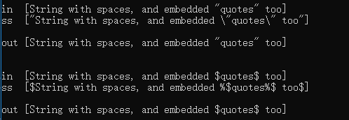

# 库特性

## 一、std::exchange 函数

定义于头文件 `<utility>`

```c++
template <class T, class U = T>
constexpr T exchange(T& obj, U&& new_value);
```

以 new_value 替换 obj 的值，并返回 obj 的旧值。

**注意：**T 必须满足可移动构造的要求。而且必须能移动赋值 `U` 类型对象给 `T` 类型对象。

`std::exchange` 的实现：

```c++
template<class T, class U = T>
constexpr T exchange(T& obj, U&& new_value) {
    T old_value = std::move(obj);
    obj = std::forward<U>(new_value);
    return old_value;
}
```

可以用在**移动构造函数**和**移动赋值运算符**中。

```c++
#include <utility>

class A {
    int n;
public:
    A(A&& other) noexcept : n{std::exchange(other.h, 0)}
    {}
    
    A& operator=(A&& other) noexcept {
        if (this != &other) {
            n = std::exchange(other.n, 0);  // move n, while leaving zero in other.n
        }
        return *this;
    }
};
```

## 二、std::make_unique 函数

C++11 中有 **std::make_shared**，却没有 **std::make_unique**，在 C++14 中已经改善。

```c++
#include <memory>
#include <iostream>

int main() {
    std::unique_ptr<int> ptr = std::make_unique<int>(100);
    std::cout << *ptr << std::endl;  // 100
}
```

## 三、std::quoted 函数

C++14 引入 **quoted** 用于给字符串添加双引号。定义于头文件 `<iomanip>`

```c++
template <typename CharT> 
/* unspecified */ quoted(const CharT* s, CharT delim=CharT('"'), CharT escape=CharT('\\'));
```

#### 参数：

s：要插入或输出的字符串

delim：用作分隔符的字符，默认为“

escape：用作转义字符的字符，默认为\

#### 流程：

1. 添加 delim 到序列中
2. 序列中添加每个来在 s 的字符，若下一个要添加的字符等于 delim 或等于 escape，首先附加 escape 到序列中。
3. 添加 delim 到序列中。

#### 示例：

```c++
#include <iostream>
#include <iomanip>
#include <sstream>

int main()
{
    std::stringstream ss;
    std::string out, in{ "String with spaces, and embedded \"quotes\" too" };

    auto show = [&](const auto &what) {
        &what == &in ?
            std::cout << "in  [" << in << "]\n"
            << "ss  [" << ss.str() << "]\n\n"
            : std::cout << "out [" << out << "]\n\n";
    };

    ss << std::quoted(in);
    show(in);
    ss >> std::quoted(out);
    show(out);

    std::cout << std::endl;
    ss.str("");

    in = "String with spaces, and embedded $quotes$ too";
    const char delim{ '$' }, escape{ '%' };

    ss << std::quoted(in, delim, escape);
    show(in);
    ss >> std::quoted(out, delim, escape);
    show(out);
    return 0;
}
```

#### 结果:



## 四、std::shared_timed_mutex 类与 std::shared_lock 类

#### std::shared_timed_mutex

定义于头文件 `<shared_mutex>`。

```c++
class shared_timed_mutex;
```

shared_timed_mutex 类是能用于保护数据免受多个线程同时访问的同步原语。与其他促进排他性访问的互斥类型相反，拥有二个层次的访问：

- 共享 - 多个线程能共享同一互斥的所有权
- 排他性 - 仅一个线程能占有互斥

共享互斥通常用于多个读线程能同时访问同一资源而不导致数据竞争，但只有一个写线程能访问的情形。

#### std::shared_lock

定位于头文件 `<shared_mutex>`。

```c++
template <class Mutex>
class shared_lock;
```

类 shared_lock 是通用共享互斥所有权包装器，允许延迟锁定、定时锁定和锁所有权的转移。锁 shared_lock，会以共享模式锁定关联的共享互斥（std::unique_lock 可用于以排他性模式锁定）。

shared_lock 类可移动，但不可复制——它满足**可移动构造**与**可移动赋值**的要求，但不满足**可复制构造**或**可复制赋值**。

#### 示例

```c++
#include <shared_mutex>

class SharedTimedMutexCounter
{
public:
	SharedTimedMutexCounter() = default;
	~SharedTimedMutexCounter() = default;

	unsigned int get() const {
		std::shared_lock<std::shared_timed_mutex> lock(m_mutex);
		return m_value;
	}

	void increment() {
		std::unique_lock<std::shared_timed_mutex> lock(m_mutex);
		++m_value;
	}

private:
	mutable std::shared_timed_mutex m_mutex;
	unsigned int m_value{ 0 };
};
```

## 五、std::integer_sequence 类

定义于头文件 `<utility>`

```c++
template<class T, T... Ints>
struct integer_sequence;
```

类模板 `std::integer_sequence` 表示一个编译时的整数序列。在用作**函数模板**的实参时，能推导参数包 `Ints` 并将它用于包展开。

#### 成员函数：

```c++
static constexpr size_t size() noexcept {
	return (sizeof...(Ints));
}
```

#### 辅助模板

- `std::index_sequence`：为帮助 `T` 为 `std::size_t` 的常用情况，定义别名模板

```c++
template<std::size_t... Ints>
using index_sequence = std::integer_sequence<std::size_t, Ints...>;
```

- `std::make_integer_sequence` 与 `std::make_index_sequence`：以简化以 0, 1, 2, ..., N-1 为 `Ints` 创建 `std::integer_sequence` 与 `std::index_sequence`：

```c++
template<class T, T N>
using make_integer_sequence = std::integer_sequence<T, /* a sequence 0, 1, 2, ..., N-1 */ >;

template<std::size_t N> 
using make_index_sequence = std::make_integer_sequence<std::size_t, N>;
```

若 `N` 为负，则程序为谬构。若 `N` 为零，则指示类型为 `integer_sequence<T>` 。

- 类模板 `std::index_sequence_for`：以转换任何类型参数包为同长度的下标序列：


```c++
template<class... T> 
using index_sequence_for = std::make_index_sequence<sizeof...(T)>;
```

#### 示例

```c++
#include <tuple>
#include <iostream>
#include <array>
#include <utility>

// 辅助调用
template <typename T, T... ints>
void print_sequence(std::integer_sequence<T, ints...> int_seq) {
	std::cout << "The sequence of size " << int_seq.size() << ":";
	((std::cout << ints << " "), ...);  // C++17 的 fold
	std::cout << std::endl;
}

// 转换数组为tuple
template<typename Array, std::size_t... I>
auto a2t_impl(const Array &a, std::index_sequence<I...>) {
	return std::make_tuple(a[I]...); 
}

template<typename T, std::size_t N, typename Indices = std::make_index_sequence<N>>
auto a2t(const std::array<T, N>& a) {
	return a2t_impl(a, Indices{});
}

// 漂亮地打印 tuple
template <class Ch, class Tr, class Tuple, std::size_t... Is>
void print_tuple_impl(std::basic_ostream<Ch, Tr> &os, const Tuple &t, std::index_sequence<Is...>) {
	((os << (Is == 0 ? "" : ",") << std::get<Is>(t)), ...);
}

template <class Ch, class Tr, class... Args>
auto &operator << (std::basic_ostream<Ch, Tr> &os, const std::tuple<Args...> &t) {
	os << "(";
	print_tuple_impl(os, t, std::index_sequence_for<Args...>{});
	return os << ")";
}

int main()
{
	print_sequence(std::integer_sequence<unsigned, 9, 2, 5, 1, 9, 1, 6>{});
	print_sequence(std::make_integer_sequence<int, 20>{});
	print_sequence(std::make_index_sequence<10>{});
	print_sequence(std::index_sequence_for<float, std::iostream, char>{});

	std::array<int, 4> array = { 1, 2, 3, 4 };

	auto tuple = a2t(array);
	static_assert(std::is_same<decltype(tuple), std::tuple<int, int, int, int>>::value, "");

	std::cout << tuple << std::endl;
}
```

## 六、用户定义字面量

#### std::chrono::duration

定义于内联命名空间 `std::literals::chrono_literals`

| 字面量        | 含义                                              |
| ------------- | ------------------------------------------------- |
| operator""h   | 表示小时的 **std::chrono::duration** 字面量(函数) |
| operator""min | 表示分钟的 **std::chrono::duration** 字面量(函数) |
| operator""s   | 表示秒的 **std::chrono::duration** 字面量(函数)   |
| operator""ms  | 表示毫秒的 **std::chrono::duration** 字面量(函数) |
| operator""us  | 表示微秒的 **std::chrono::duration** 字面量(函数) |
| operator""ns  | 表示纳秒的 **std::chrono::duration** 字面量(函数) |

```c++
using namespace std::chrono_literals;
auto day = 24h;
day.count(); // == 24
std::chrono::duration_cast<std::chrono::minutes>(day).count(); // == 1440
```

#### std::basic_string

定义于内联命名空间 `std::literals::string_literals`

| 字面量      | 含义                                       |
| ----------- | ------------------------------------------ |
| operator""s | 转换字符数组字面量为 `basic_string` (函数) |

```C++
#include <string>
#include <iostream>
 
int main()
{
    using namespace std::string_literals;
 
    std::string s1 = "abc\0\0def";
    std::string s2 = "abc\0\0def"s;
    std::cout << "s1: " << s1.size() << " \"" << s1 << "\"\n";
    std::cout << "s2: " << s2.size() << " \"" << s2 << "\"\n";
}
```

