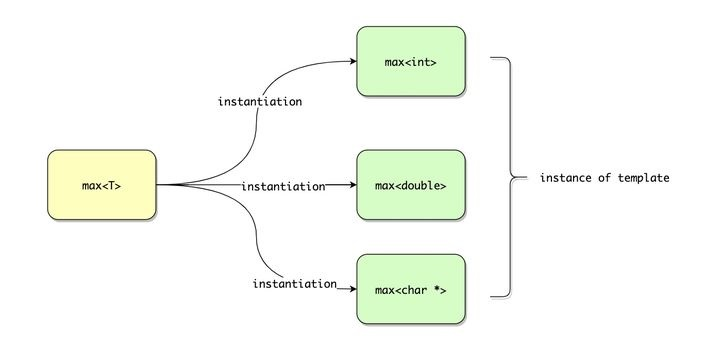

# 函数模板

## 一、定义

```c++
template<typename T>
T max(T a,T b) 
{
    return b < a ? a : b;
}
```

## 二、使用

```c++
std::cout << max(7, 42) << std::endl;
std::cout << max(1.1, 2.2) << std::endl;
std::cout << max("math", "mathematics") << std::endl;
```

模板不是被编译成可以处理任何类型的单个函数。相反，编译器会针对每一个使用该模板的类型生成对应的函数。如，`max(7, 42)` 的调用在语义上相当于调用了：

```cpp
int max(int a,int b) 
{
    return b < a ? a : b;
}
```

double、string 也一样。

**将模板参数替换成具体参数类型的过程叫做 instantiation(实例化)，这个过程会产生一个 instance of template。**




## 三、两阶段翻译

如果某一特定参数类型不支持模板内的操作，那么编译阶段会报错：

```c++
std::complex<float> c1, c2;  // complex 不支持 max 中的 < 操作，编译阶段会报错
max(c1, c2);
```

模板会分成两个阶段进行"编译"：

1. 在不进行模板 instantiation 的 definition time 阶段，此时会忽略模板参数，检查如下方面：
   - 语法错误，包括缺失分号
   - 使用未定义参数
   - 如果 static assertion 不依赖模板参数，会检查 static assertion
2. instantiation 阶段，会再次检查模板里所有代码的正确性，尤其是那些依赖模板参数的部分。

```c++
template <typename T>
void foo(T t)
{
    undeclared();  // first-phase compile-time error if undeclared() unknown

    undeclared(t);  // second-phase compile-time error if undeclared(T) unknown

    static_assert(sizeof(int) > 10, "int too small");  // first-phase compile-time error

    static_assert(sizeof(T) > 10, "T too small");  // second-phase compile-time error
}
```


### 模板的编译和链接问题

大多数人会按照如下方式组织非模板代码：将类或者其他类型声明放在头文件(.h)中，将函数定义等放到一个**单独的编译单元**文件中(.cpp)。但是这种组织方式在包含模板的代码中却行不通，如：

```c++
// XXX.h
#pragma once
// declaration of template
template <typename T>
void printTypeof(const T&);

// XXX.cpp
#include <iostream>
#include <typeinfo>
#include "XXX.h"
// implementation/definition of template
template <typename T>
void printTypeof(const T& x) 
{
    std::cout << typeid(x).name() << '\n';
}
```

在另一个文件中使用该模板：

```c++
// main.cpp
#include "XXX.h"

int main() 
{
    double ice = 3.0;
    printTypeof(ice); // call function template for type double
}
```

在 C/C++ 中，当编译阶段发现一个符号(printTypeof)没有定义只有声明时，编译器会假设它的定义在其他文件中，所以编译器会留一个"坑"给链接器 linker，让它去填充真正的符号地址。

但是上面说过，模板是比较特殊的，需要在编译阶段进行 instantiation，即需要进行模板参数类型推断，实例化模板，当然也就需要知道函数的定义。但是由于上面两个 cpp 文件都是**单独的编译单元文件**，所以当编译器编译 main.cpp 时，它没有找到模板的定义，自然也就没有 instantiation。

解决办法就是**把模板的声明和定义都放在一个头文件**。

## 四、多模板参数

```c++
template <typename T1, typename T2>
T1 max(T1 a, T2 b)
{
    return b < a ? a : b;
}

auto m = max(4, 7.2);  // 注意：返回类型是第一个模板参数 T1 的类型
// 返回值为：4
```

max 的返回值类型总是 T1。

一般有三个方法解决这个问题：

- 引入额外模板参数作为返回值类型
- 让编译器自己找出返回值类型
- 将返回值声明为两个模板参数的公共类型，比如 int 和 float，公共类型就是 float

### 1. 引入额外模板参数作为返回值类型

在函数模板的参数类型推导过程中，一般不用显式指定模板参数类型。但是当模板参数不能根据传递的参数推导出来时，就需要显式指定模板参数类型。

```c++
template<typename T1, typename T2, typename RT>
RT max(T1 a, T2 b);
```

RT 是不能根据函数的参数列表推导出来的，所以需要显式的指定：

```c++
max<int, double, double>(4, 7.2);
```

或者改变模板参数列表顺序，这种情况只需显式的指定一个参数类型即可：

```c++
template <typename RT, typename T1, typename T2>  // RT 变为第一个模板参数
RT max(T1 a, T2 b);

max<double>(4, 7.2);
```

### 2. 让编译器自己找出返回值类型

在 C++11 中，可以利用 auto 和 trailing return type 来让编译器自己找出返回值类型：

```c++
template <typename T1, typename T2>
auto max(T1 a, T2 b) -> decltype(b < a ? a : b) 
{
    return b < a ? a : b;
}
```

decltype 可以获取到表达式的类型，可以写的更简单点：

```c++
template <typename T1, typename T2>
auto max(T1 a, T2 b) -> decltype(true ? a : b)
{
    return b < a ? a : b;
}
```

看到 `true ? a : b` 不要奇怪为什么是 true，**这里的重点不是计算返回值，而是得到返回值类型。**

在 C++14 中，可以省略 trailing return type：

```c++
template <typename T1, typename T2>
auto max(T1 a, T2 b) 
{
    return b < a ? a : b;
}
```

### 3. 将返回值声明为两个模板参数的公共类型

C++11 中 `std::common_type` 可以产生几个不同类型的共同类型：

```c++
template <typename T1, typename T2>
typename std::common_type<T1, T2>::type max(T1 a, T2 b)
{
    return b < a ? a : b;
}
```

在 C++14 中，可以更简单的写：

```c++
template <typename T1, typename T2>
std::common_type_t<T1, T2> max(T1 a, T2 b)
{
    return b < a ? a : b;
}
```

这里使用 `_t` 后缀让我们不用写 `typename` 和 `::type`。类似的还有 `_v`，在 C++14 的 `type traits` 里很常见。


## 五、默认模板参数

这个很像函数的默认参数。

```c++
template <typename T1, typename T2, typename RT = std::common_type_t<T1, T2>>
RT max(T1 a, T2 b)
{
    return b < a ? a : b;
}

auto a = max(4, 7.2);
auto b = max<double,int,long double>(7.2, 4);
```

如果想显示的指明 RT 的类型，必须显示的指出全部三个参数类型。**但是与函数默认参数不同的是，可以将模板的默认参数放到第一个位置：**

```c++
template <typename RT = long, typename T1, typename T2>
RT max(T1 a, T2 b) 
{
    return b < a ? a : b;
}

int i;
long l;

max(i, l);  // 返回值类型是 long (RT 的默认值)
max<int>(4, 42);  // 返回 int，因为其被显式指定
```

## 六、重载函数模板

这个跟普通函数重载也类似：

```c++
// maximum of two int values:
int max(int a, int b) 
{
    return b < a ? a : b;
}

// maximum of two values of any type:
template <typename T>
T max(T a, T b)
{
    return b < a ? a : b; 
}

int main() 
{
    max(7, 42);  // calls the nontemplate
    max(7.0, 42.0);  // calls max<double> (by argument deduction)
    max('a', 'b');  // calls max<char> (by argument deduction)
    max<>(7, 42);  // calls max<int> (by argument deduction)
    max<double>(7, 42);  // calls max<double> (no argument deduction)
    max('a', 42.7);  // calls the nontemplate
}
```

对于 `max('a', 42.7)`，**因为在模板参数类型推导过程中不允许类型自动转换，但是调用普通函数是允许的，所以这个会调用非模板函数。**

**ps. 由于函数模板重载，所以函数模板并不像类模板一样可以进行偏特化。**

**确保所有被重载的函数模板在使用时已经被声明定义**

```c++
// maximum of two values of any type:
template <typename T>
T max(T a, T b)
{
    std::cout << "max<T>()\n";
    return b < a ? a : b;
}

// maximum of three values of any type:
template <typename T>
T max(T a, T b, T c) 
{
    return max(max(a, b), c);
}

// maximum of two int values:
int max(int a, int b) 
{
    std::cout << "max(int,int) \n";
    return b < a ? a : b;
}

int main()
{
    max(47, 11, 33);    // max<T>()
}
```

