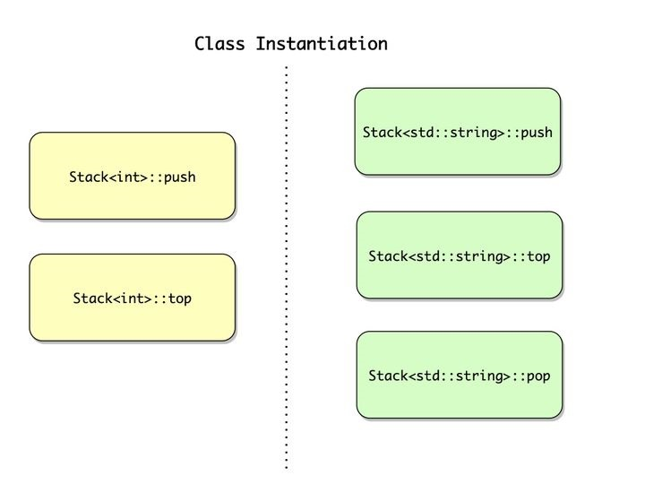
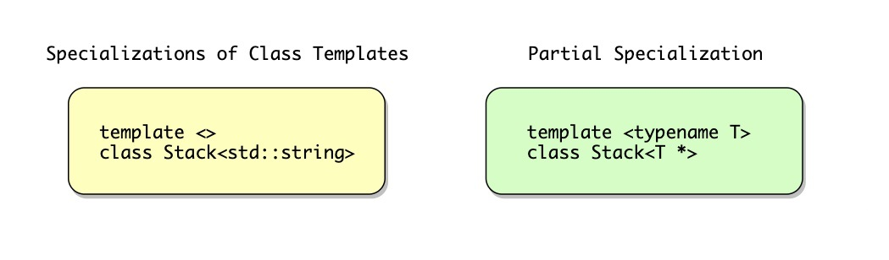
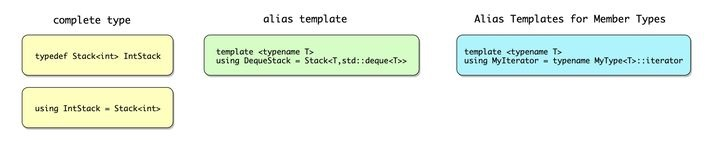

# 类模板

## 一、定义与使用

定义：

```c++
template <typename T>
class Stack
{
private:
    std::vector<T> elems;
public:
    void push(const T& elem);
    void pop();
    const T& top() const;
    bool empty() const
    {
        return elems.empty();
	}
};

template <typename T>
void Stack<T>::push(const T& elem)
{
    elems.push_back(elem);
}

template <typename T>
void Stack<T>::pop()
{
    assert(!elems.empty());
    elems.pop_back();
}

template <typename T>
const T& Stack<T>::top() const
{
    assert(!elems.empty());
    return elems.back();
}
```

使用：

```c++
int main()
{
    Stack<int> intStack;
    Stack<std::string> strStack;

    // manipulate int stack
    intStack.push(7);
    std::cout << intStack.top() << '\n';

    // manipulate string stack
    strStack.push("hello");
    std::cout << strStack.top() << '\n';
    strStack.pop();
}
```

有两点需要注意：

- 在类声明内的构造函数、拷贝构造函数、析构函数、赋值等用到类名字的地方，可以将 `Stack<T>` 简写为 `Stack`。但是在类外，还是需要 `Stack<T>`。

- 不可以将类模板声明或定义在函数或者块作用域内。通常类模板只能定义在 global/namespace 作用域，或者是其它类的声明里面。

## 二、Class Instantiation

instantiation 的概念在函数模板中有提到。在类模板中，类模板函数只有在被调用时才会被 instantiate。在上面的例子中，`push()` 和 `top()` 都会被 `Stack<int>` 和 `Stack<std::string>` 所 `instantiate`，但是 `pop()` 只被 `Stack<std::string>` 所 `instantiate`。



## 三、使用类模板的部分成员函数

为 Stack 增加 `print()` 函数，需要 elem 支持 `<<` 操作：

```c++
template<typename T>
class Stack
{
    void print(std::ostream& strm) const
    {
        for (const T& elem : elems) {
            strm << elem << ' ';
        }
    }
};
```

关于类模板的 instantiation，只有使用到该函数时才会进行该函数的 instantiation。假如模板参数的类型不支持 `<<`，那么仍然可以使用该类的其他函数，只有调用 `print()` 的时候才会报错：

```c++
// note: std::pair<> has no operator<<
Stack<std::pair<int, int>> ps;

ps.push({ 4, 5 });  // OK
ps.push({ 6, 7 });  // OK
std::cout << ps.top().first << std::endl;  // OK
std::cout << ps.top().second << std::endl;  // OK

ps.print(std::cout);  // ERROR: operator<< not supported for element type
```

### Concept

这就引出了一个问题，如何知道一个类模板和它的模板函数需要哪些操作？

在 C++11 中，有 `static_assert`。

```c++
template <typename T>
class Foo
{
    static_assert(std::is_default_constructible<T>::value, "Class Foo requires default-constructible elements");
};
```

假如没有 static_assert，提供的模板参数不满足 `std::is_default_constructible`，代码也编译不过。但是编译器产出的错误信息会很长，包含整个模板 instantiation 的信息——从开始 instantiation 直到引发错误的地方，很难找出错误的真正原因。

所以使用 static_assert 是一个办法。但是 static_assert 适用于做简单的判断，实际场景会更加复杂，例如判断模板参数是否具有某个特定的成员函数，或者要求它们支持互相比较，这种情况下使用 concept 就比较合适。

concept 是 C++20 中用来表明模板库限制条件的一个特性，在后面会单独说明。

## 四、友元

**友元虽然看起来好像是该类的一个成员，但是友元不属于这个类。这里友元指的是友元函数和友元类。**

### 方式一

```c++
template <typename T>
class Stack
{
    void print(std::ostream& strm) const
    {
        for (const T& elem : elems) {
            strm << elem << ' ';
        }
    }

    template <typename U>
    friend std::ostream &operator<<(std::ostream&, const Stack<U>&);
};

template <typename T>
std::ostream &operator<<(std::ostream& strm, const Stack<T>& s)
{
    s.print(strm);
    return strm;
}
```

在类中声明的友元函数使用的是与类模板不同的模板参数 `template <typename U>`，是因为友元函数的模板参数与类模板的模板参数不互相影响，**这可以理解为创建了一个新的函数模板。**

```c++
template <typename T>
class Foo
{
    template <typename U>
    friend class Bar;
};
```

这里也使用的是不同的模板参数。也就是：`Bar<char>`、`Bar<int>`、`Bar<float>` 和其他任何类型的 Bar 都是 `Foo<char>` 的友元。

### 方式二

```c++
template<typename T>
class Stack;

template<typename T>
std::ostream& operator<< (std::ostream&, const Stack<T>&);

template<typename T>
class Stack
{
    friend std::ostream& operator<< <T>(std::ostream&, const Stack<T>&);
};
```

这里提前声明了 Stack 与 operator<<，并且在类模板中，operator<< 后面使用了 `<T>`，没有使用新的模板参数。**与第一种方式对比，这里创建了一个特例化的非成员函数模板作为友元(注意这个友元函数的声明，是没有 `<T>` 的)。**

```c++
template <typename T>
class Bar;

template <typename T>
class Foo
{
    friend class Bar<T>;
};
```

**这里只有 `Bar<char>` 是 `Foo<char>` 的友元类。**

关于类模板友元规则有很多，知道有哪几大类规则即可（Friend Classes of Class Templates、Friend Functions of Class Templates、Friend Templates），用到的时候再查也来得及。

## 五、类模板的全特化

与函数模板类似，如果想要全特化一个类模板，必须全特化这个类模板的所有成员函数。

在类声明的开始处，需要使用 `template<>` 并且表明类模板的全特化参数类型；在成员函数中，需要将 `T` 替换成特化的参数类型。

```c++
template <>
class Stack<std::string>
{
private:
    std::vector<std::string> elems;
public:
    void push(const std::string& elem);
    void pop();
    const std::string& top() const;
    bool empty() const
    {
        return elems.empty();
    }
};

void Stack<std::string>::push(const std::string& elem)
{
    elems.push_back(elem);
}

void Stack<std::string>::pop()
{
    assert(!elems.empty());
    elems.pop_back();
}

const std::string& Stack<std::string>::top() const
{
    assert(!elems.empty());
    return elems.back();
}
```

## 六、类模板的偏特化

类模板可以针对某一些场景进行部分特化，比如针对模板参数是指针进行偏特化：

```c++
template <typename T>
class Stack<T*>
{
private:
    std::vector<T*> elems;
public:
    void push(T* elem);
    void pop();
    const T* top() const;
    bool empty() const
    {
        return elems.empty();
    }
};

template <typename T>
void Stack<T*>::push(T* elem)
{
    elems.push_back(elem);
}

template <typename T>
void Stack<T*>::pop()
{
    assert(!elems.empty());
    elems.pop_back();
}

template <typename T>
const T* Stack<T*>::top() const
{
    assert(!elems.empty());
    return elems.back();
}

Stack<int*> ptrStack;
ptrStack.push(new int{ 42 });
```

注意类声明与全特化的不同：

```c++
template<typename T>
class Stack<T*>
{};
```

### 多模板参数的偏特化

与函数模板重载类似。

```c++
template <typename T1, typename T2>
class Foo
{};

template <typename T>
class Foo<T, T>
{};

template <typename T>
class Foo<T, int>
{};

template<typename T1, typename T2>
class Foo<T1*, T2*>
{};
```

使用：

```c++
Foo<int, float> fif;  // use Foo<T1, T2>
Foo<float, float> fff;  // use Foo<T, T>
Foo<float, int> ffi;  // use Foo<T, int>
Foo<int*, float*> fp;  // use Foo<T1*, T2*>
```

同样也会有重载冲突：

```c++
Foo<int, int> f;  // ERROR: matches Foo<T, T> and Foo<T, int>
Foo<int*, int*> f;  // ERROR: matches Foo<T, T> and Foo<T1*, T2*>
```



## 七、默认模板参数

与函数默认参数类似。

例如：为 `Stack<>` 增加一个默认参数，代表管理 Stack 元素的容器类型。

```c++
template <typename T, typename Cont = std::vector<T>>
class Stack
{
private:
    Cont elems;
public:
    void push(const T& elem);
    void pop();
    const T& top() const;
    bool empty() const
    {
        return elems.empty();
    }
};
```

注意定义成员函数的模板参数变成了2个：

```c++
template <typename T, typename Cont>
void Stack<T, Cont>::push(const T& elem)
{
    elems.push_back(elem);
}
```

使用：

```c++
Stack<int> nStack;
Stack<double, std::deque<double>> dStack;
```

## 八、类型别名

两种方式：typedef、using（C++11）

- typedef

```c++
typedef Stack<int> IntStack;
void foo(const IntStack& s);
IntStack nstack[10];
```

- using

```c++
using IntStack = Stack<int>;
void foo(const IntStack& s);
IntStack nstack[10];
```

### 别名模板

**using 比 typedef 有一个很大的优势是可以定义别名模板：**

```c++
template <typename T>
using DequeStack = Stack<T, std::deque<T>>;

DequeStack<int> ds;
```

像 `std::common_type_t`，实际上就是一个别名：

```c++
template <class ..._Tp>
using common_type_t = typename common_type<_Tp...>::type;
```

### Alias Templates for Member Types

```c++
// typedef
class Foo
{
    typedef ... iterator;
};

// using
class Foo
{
    using iterator = ...;
};
```

使用：

```c++
template <typename T>
using FooIterator = typename Foo<T>::iterator;  // typename 必须有
FooIterator<int> pos;
```

### 关键字 typename

上面的注释说明了：`typename Foo<T>::iterator` 里的 `typename` 是必须的，因为这里的 `typename` 代表后面紧跟的是一个定义在类内的类型，否则，`iterator` 会被当成一个静态变量或者枚举：

```c++
template <typename T>
class B 
{
public:
    static int x;  // 类内的静态变量
    using iterator = ...;  // 类内定义的类型
};

template <typename T>
int B<T>::x = 20;

int main()
{
    typename B<int>::iterator aa;
    std::cout << B<int>::x;  // 20
    return 0;
}
```



## 九、类模板的参数推导

在 C++17 中，如果构造函数能够推导出所有的模板参数，那么就不需要显示指明模板参数类型。

```c++
Stack<int> nStack1;
Stack<int> nStack2 = nStack1;
Stack nStack3 = nStack1;  // OK since C++17
```

### 推断指引（Deduction Guides）

可以使用 `Deduction Guides` 来提供额外的模板参数推导规则，或者修正已有的模板参数推断规则。

```c++
Stack(const char*) -> Stack<std::string>;
Stack stringStack{"bottom"};  // OK: Stack<std::string> deduced since C++17
```

