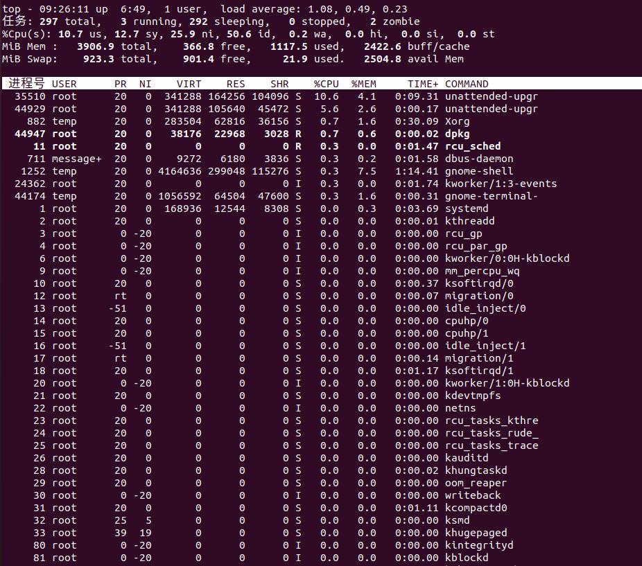

# 常用系统工作命令

## 1. echo 命令

**echo** 命令用于在终端输出字符串或变量提取后的值。格式：

```shell
echo [字符串|$变量]
```

Linux 系统中变量名一般大写。

## 2. date 命令

**date** 命令用于显示及设置系统的时间或日期，格式：

```shell
date [选项][+指定的格式]
```

| 参数 | 作用           |
| ---- | -------------- |
| %t   | 跳格[Tab键]    |
| %H   | 小时（00~23）  |
| %I   | 小时（00~12）  |
| %M   | 分钟           |
| %S   | 秒             |
| %i   | 今年中的第几天 |
| %Y   | 年             |
| %m   | 月             |
| %d   | 日             |

```shell
date "+%Y-%m-%d %H:%M:%S"  # 2020-07-07 09:21:30
date -s "20200808 08:30:00"  # 设置系统时间
date "+%j"  # 查看今天是当年中的第几天
```

## 3. reboot 命令

**reboot** 命令用于重启系统，格式：

```shell
reboot
```

## 4. poweroff 命令

**poweroff** 命令用于关闭系统，格式：

```shell
poweroff
```

## 5. wget 命令

**wget** 命令用于在终端中下载网络文件，格式为

```shell
wget [参数] 下载地址
```

| 参数 | 作用                                 |
| ---- | ------------------------------------ |
| -b   | 后台下载模式                         |
| -P   | 下载到指定目录                       |
| -t   | 最大尝试次数                         |
| -c   | 断点续传                             |
| -p   | 下载页面内所有资源，包括图片、视频等 |
| -r   | 递归下载（下载某个目录下的所有文件） |

```shell
wget -r -p https://ww.baidu.com  # 递归下载 www.baidu.com 网站内的所有页面数据以及文件
```

## 6. ps 命令

**ps** 命令用于查看系统中进程状态，格式：

```shell
ps [参数]
```

| 参数 | 作用                               |
| ---- | ---------------------------------- |
| -a   | 显示所有进程（包括其他用户的进程） |
| -u   | 用户以及其他详细信息               |
| -x   | 显示没有控制终端的进程             |

在 linux 系统中，有 5 种常见的进程状态，分别为运行、中断、不可中断、僵死和停止。

1. R（运行）：进程正在运行或在运行队列中等待
2. S（中断）：进程处于休眠中，当某个条件形成后或者接受到信号时，则脱离该状态
3. D（不可中断）：进程不响应系统异步信号，即便用 kill 命令也不能将其中断
4. Z（僵死）：进程已经终止，但进程描述符依然存在，直到父进程调用 wait() 系统函数后将进程释放
5. T（停止）：进程收到停止信号后停止运行

```shell
ps -aux # 命令参数有长短格式之分，短格式和短格式之间是可以合并的，合并后仅保留一个-(减号)即可。
```

## 7. top 命令

**top** 命令用于动态地监视进程活动与系统负载等信息，格式：

```shell
top
```

top 命令相当强大，能够动态地查看系统运维状态，完全将它看作 Linux 中的“强化版的 Windows 任务管理器”。



前 5 行是统计信息区

第一行是任务队列信息，同 uptime 命令的执行结果。其中 load 表示系统负载(任务队列的平均长度)，值越大表示当前系统就越繁忙

第二、三行为进程和 CPU 的信息。当有多个 CPU 时，这些内容可能会超过两行

第四、五行为内存信息

第四行：Mem: total 物理内存总量，used 使用的物理内存总量，free 空闲内存总量，buffers 用作内核缓存的内存量

第五行表示 Swap 分区的使用情况

接下来是进程列表。默认按照 CPU 占用情况降序排序（第一行就是当前占用 CPU 最多的进程）

常用列解释:

| 列名    | 说明                                                         |
| ------- | ------------------------------------------------------------ |
| 进程号  | 进程 id                                                      |
| USER    | 进程拥有者的用户 id                                          |
| PR      | 进程优先级                                                   |
| NI      | nice 值，和 PR 搭配使用                                      |
| VIRT    | 虚拟内存使用情况                                             |
| RES     | 物理内存使用情况(如果进程使用的物理内存的和接近机器的物理内存总量, 就会出现内存不够用的情况) |
| %CPU    | 该进程占用 CPU 的百分比(多核机器这个值可以超过 100%)         |
| COMMAND | 对应到这个进程启动的命令                                     |

top 的一些常见用法：

1) 查看占用内存最多的前 N 个进程

先执行 top 命令, 再使用快捷键 M 即可按内存占用降序排序

2) 查看 CPU 占用最多的前 N 个进程

先执行 top 命令, 再使用快捷键 P 即可按照 CPU 占用降序排序

3) 查看某个进程中的线程情况

top -p [pid]

然后再使用快捷键 H 即可查看线程相关信息

## 8. pidof 命令

**pidof** 命令用于查询某个指定服务进程的 PID 值，格式：

```shell
pidof [参数][服务名称]
```

## 9. kill 命令

**kill** 命令用于终止某个指定 PID 的服务进程，格式：

```shell
kill [参数][进程PID]
```

## 10. killall 命令

**killall** 命令用于终止某个指定名称的服务所对应的全部进程，格式：

```shell
killall [参数][进程名称]
```

