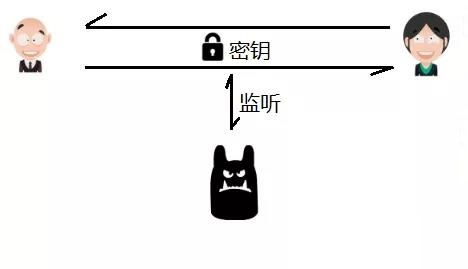
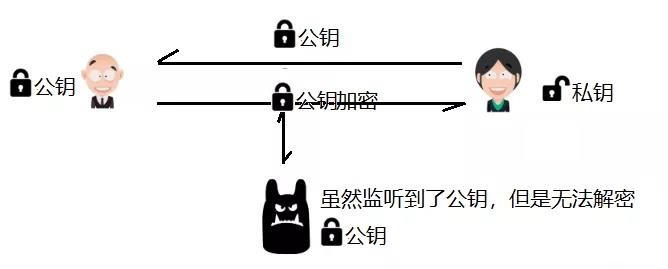
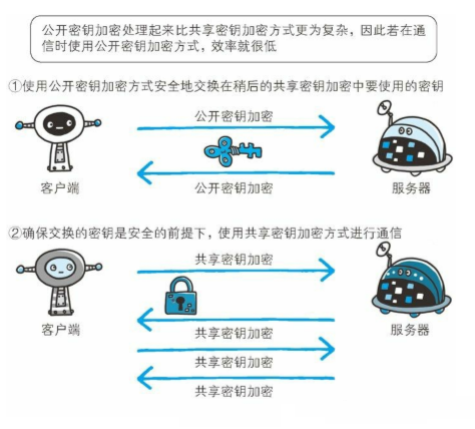
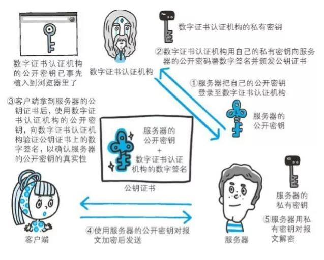

# https 的 SSL 认证过程

## 一、什么是 SSL

SSL（Secure Sockets Layer 安全套接字协议），及其继任者传输层安全（Transport Layer Security，TLS）是为网络通信提供安全及数据完整性的一种安全协议。

SSL 协议建立在可靠的传输协议（如 TCP）之上，在 TCP 建立连接之后，实际数据传输之前，通讯双方通过身份认证以及加密传输实现整体的安全传输。

## 二、加密传输

SSL 协议中的加密传输，采用对称加密和非对称加密的混合加密方式完成。

**对称加密**

加密和解密共用一个密钥的方式称为**对称加密**。

但是这种对称密钥的交换存在通信被监听的风险，密钥交换被监听，密钥信息落入黑客之手，则失去了加密的意义。

**非对称加密**

非对称加密方式很好地解决了对称加密的困难。

非对称加密需要两个密钥来进行加密和解密，一把叫做**私有密钥**（private key），另一把叫做**公开密钥**（public key）。

顾名思义，私有密钥不能让其他任何人知道，而公开密钥则可以随意发布，任何人都可以获得。

通信时将公钥交给对方，对通信数据进行加密，接收到数据后使用私钥进行解密。

要想根据密文和公开密钥，恢复到信息原文是异常困难的，因为解密过程就是在对离散对数进行求值，这并非轻而易举就能办到。

**混合加密机制**

非对称加密，不容易被破解，因此更安全，但是对应其解密速度效率就会较低。而对称加密容易被监听，失去加密的意义，但是解密速度较快。因此混合加密机制旨在融合两种加密各自的优点，采用**非对称加密过程保护对称密钥的交换，然后采用对称密钥进行加密通信**。

## 三、身份认证

虽然混合加密机制保证的数据加密不会被窃听，但是一旦通信被劫持，中间黑客劫持通信过程或许在公开密钥传输途中，真正的公开密钥已经被攻击者替换掉了，黑客拿到服务器的公钥后，将自己的公钥发送给客户端，则对于客户端就会出现认贼作父的风险。

因此**客户端必须能够验证自己收到的公钥的正确性**，而这个验证**通过CA认证**实现，数字证书认证机构处于客户端与服务器双方都可信赖的第三方机构的立场上。

**CA认证**

CA认证，即电子认证服务，是指为电子签名相关各方提供真实性、可靠性验证的活动。

证书颁发机构（CA, Certificate Authority）即颁发数字证书的机构。是负责发放和管理数字证书的权威机构，并作为电子商务交易中受信任的第三方，**承担公钥体系中公钥的合法性检验的责任**。

## 四、总结

**1、SSL 协议是什么**

SSL 是安全套接字协议，建立在可靠的传输协议（如 TCP）之上，在 TCP 建立连接之后，实际数据传输之前，通讯双方通过身份认证以及加密传输实现整体的安全传输。

**2、其中实现安全传输的过程的分步表达**

- 服务器通过非对称加密算法生成一对秘钥（公钥与私钥），拿着公钥去权威机构生成 CA 证书，证书中包含自己的机构信息以及权威机构信息，以及证书的有效期，公钥信息等

- 在 tcp 建立连接后，服务器首先将自己在权威机构颁发的证书发送给客户端

- 客户端收到证书后，解析得到机构信息以及公钥信息，然后去自己信任的权威机构对当前服务器进行身份验证，通过则通信继续，否则可以选择中断通信或者忽略检测

- 拿着证书中的公钥加密自己要发送给服务端的数据，数据中包含自己支持的对称加密算法列表以及一个随机数

- 服务端收到客户端的公钥加密数据后，使用私钥进行解密，得到对方的对称算法列表和随机数，然后给客户端也回复一个随机数

- 双方通过自己与对方的随机数以及算法列表计算最终得到一个对称加密算法进行加密实际的数据传输