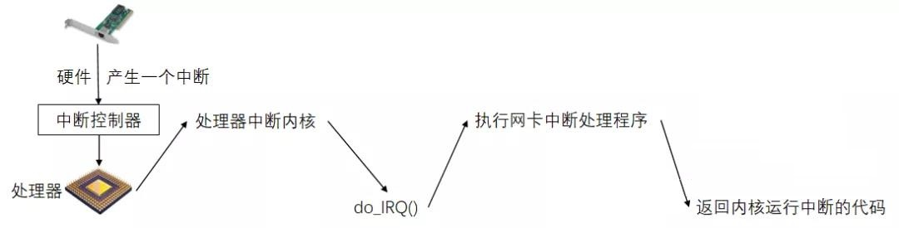

# 从底层理解 select 和 epoll 的区别

## 一、网络数据是怎么接收到的？

网卡收到网线传送过来的数据，经过硬件电路传送到内存，将数据写在内存的某个地址中。

网卡将数据写入内存后，网卡产生一个中断，通过总线把电信号发送给中断控制器。中断控制器把中断发送给处理器，也就是通过电信号给处理器特定的管脚发送一个高电平。处理器立即停止它正在做的事，然后跳转到内存中预定义的位置开始执行那里的代码，这个预定义的位置由内核设置的，是中断处理程序的入口点。

对于每个中断线，处理器会跳到对应的一个唯一的位置，这样，内核就知道接收中断的 IRQ 号，然后调用函数 do_IRQ()，最终调到网卡中断处理程序去处理数据。

## 二、read 读不到数据是怎么阻塞的？

网络应用程序调用到 read() 读取数据时，如果没有数据就一直阻塞。阻塞的话，就会将当前进程从工作队列中移除，放入到等待队列中。当数据到达时，又放入工作队列中。

假如 A 进程是一个网络应用程序，调用 socket 函数，文件系统会创建一个有接收缓冲、发送缓冲和等待队列的 sock 对象，这个等待队列指向了所有需要等待该 socket 事件的进程。

当进程执行到 read() 时，A 进程就从工作队列中移到该 socket 的等待队列中，A 进程就被阻塞。

阻塞期间，如果来数据了，中断处理就会将数据装入接收队列，然后唤醒 A 进程，移动到工作队列中。

## 三、如何同时监控多个 socket?

每个 read 只能监控一个 socket，select 的想法是，预先传入一个 socket 数组，如果数组中的所有 socket 都没有数据，进程就被挂起，直到有 socket 收到数据，唤醒进程。

如果需要监控1，2，3三个 socket，就把 A 进程加入三个 socket 的等待队列中。

当其中任何一个 socket 有数据，就将进程唤醒，从所有的等待队列中移除，加入工作队列。被唤醒后，A 进程知道至少有一个 socket 有数据了，遍历一遍，就能得到所有就绪的 socket。

这里有两个问题：

1. 每次调用 select 都需要将进程加入到所有要监控的 socket 的等待队列中，每次唤醒都要从所有的队列中移除。并且每次都要将整个 fds 数组传递给内核，开销比较大。
2. 被唤醒后，进程并不知道哪些 socket 有数据，需要遍历。

## 四、epoll的改进

1. select 低效的一个原因，是因为每次调用它都需要维护等待队列和阻塞进程，而大多数情况，需要将进程放入哪些 socket 的等待队列都是固定的，不需要每次都修改。所以，epoll 将等待队列和阻塞进程分开了，使用 epoll_ctl 维护等待队列，使用 epoll_wait 阻塞进程。
2. 对于 select 不知道哪些 socket 收到数据，需要遍历，epoll 内部维护了一个就绪队列，收到数据的 socket 直接加入就绪队列，当进程被唤醒，只要获取就绪队列 rdlist 就能知道哪些 socket 收到数据了。

##  五、epoll的实现

调用 epoll_create，返回一个文件描述符，内核会创建 eventpoll 对象。

通过 epoll_ctl，将向 eventpoll 中的红黑树添加所有要监控的 socket，和删除不需要监控的 socket。

执行 epoll_wait，由于 rdlist 为空，将 A 进程放入 eventpoll 的等待队列，阻塞进程。当某个 socket 收到数据，就加入到 rdlist，同时唤醒 eventpoll 中的等待进程，加入工作队列。所有有数据的 socket 都在 rdlist 中。

