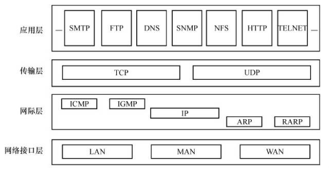
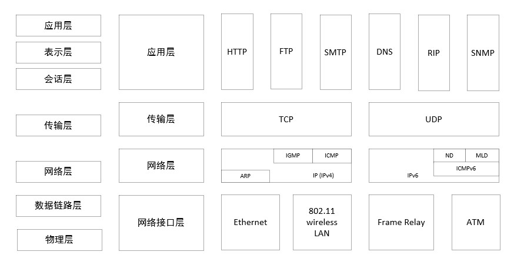

# TCP/IP

### 一、TCP/IP 模型

TCP/IP 协议模型 (Transmission Control Protocol/Internet Protocol)，包含了一系列构成互联网基础的网络协议，是 Internet 的核心协议。

基于 TCP/IP 的参考模型将协议分成四个层次，它们分别是链路层、网络层、传输层和应用层。下图表示 TCP/IP 模型与 OSI 模型各层的对照关系。

TCP/IP 协议族按照层次由上到下，层层包装。最上面的是应用层，这里面有 http，ftp 等协议。而第二层则是传输层，著名的 TCP 和 UDP 协议就在这个层次。第三层是网络层，IP 协议就在这里，它负责对数据加上 IP 地址和其他的数据以确定传输的目标。第四层是数据链路层，这个层次为待传送的数据加入一个以太网协议头，并进行 CRC 编码，为最后的数据传输做准备。

上图清楚地表示了 TCP/IP 协议中每个层的作用，而 TCP/IP 协议通信的过程其实就对应着数据入栈与出栈的过程。入栈的过程，数据发送方每层不断地封装首部与尾部，添加一些传输的信息，确保能传输到目的地。出栈的过程，数据接收方每层不断地拆除首部与尾部，得到最终传输的数据。

上图以 HTTP 协议为例，具体说明。

### 二、数据链路层

物理层负责0、1比特流与物理设备电压高低、光的闪灭之间的互换。数据链路层负责将0、1序列划分为数据帧从一个节点传输到临近的另一个节点，这些节点是通过 MAC 来唯一标识的（MAC，物理地址，一个主机会有一个 MAC 地址）。

- 封装成帧：把网络层数据报加头和尾，封装成帧，帧头中包括源 MAC 地址和目的 MAC 地址。
- 透明传输：零比特填充、转义字符。
- 可靠传输：在出错率很低的链路上很少用，但是无线链路 WLAN 会保证可靠传输。
- 差错检测（CRC）：接收者检测错误，如果发现差错，丢弃该帧。
- 以太网帧的MTU（帧的最大传输单元）是1500字节。

### 三、网络层

网络层实现数据包的选路和转发。网络层使用 IP 地址寻找一台机器，而数据链路层使用物理地址寻找一台机器。

#### 1、ARP 及 RARP 协议

ARP 协议（Address Resolve Protocol，地址解析协议）和 RARP 协议（Reverse Address Resolve Protocol，逆地址解析协议）。实现了 IP 地址和机器物理地址（MAC地址）之间的相互转换。

ARP 协议是根据 IP 地址获取 MAC 地址的一种协议。

ARP 协议是一种解析协议，本来主机是完全不知道目的 IP 对应的是哪个主机的哪个接口，当主机要发送一个 IP 包的时候，会首先查一下自己的 ARP 高速缓存（就是 IP-MAC 地址对应表缓存）。

如果查询的 IP－MAC 值不存在，那么主机就向网络发送一个 ARP 协议广播包，这个广播包里面就有待查询的 IP 地址，而直接收到这份广播的包的所有主机都会查询自己的 IP 地址，如果收到广播包的某一个主机发现自己符合条件，那么就准备好一个包含自己的 MAC 地址的 ARP 包传送给发送 ARP 广播的主机。

而广播主机拿到 ARP 包后会更新自己的 ARP 缓存（存放 IP-MAC 对应表的地方）。发送广播的主机就会用新的 ARP 缓存数据向数据链路层发送数据包。

RARP 协议的工作与此相反，仅用于网络上的某些无盘工作站。

#### 2、IP 协议

IP 协议是 TCP/IP 协议的核心，所有的 TCP，UDP，IMCP，IGMP 的数据都以 IP 数据格式传输。要注意的是，**IP 不是可靠的协议**，即 IP 协议没有提供一种数据未传达以后的处理机制，这被认为是上层协议 TCP 或 UDP 要做的事情。

##### IP 地址

在数据链路层中我们一般通过 MAC 地址来识别不同的节点，而在 IP 层我们也要有一个类似的地址标识，这就是 IP 地址。

IP 地址是由32位二进制数组成，分为网络位和地址位，这样做可以减少路由器中路由表记录的数目，有了网络地址，就可以限定拥有相同网络地址的终端都在同一个范围内，那么路由表只需要维护一条这个网络地址的方向，就可以找到相应的这些终端了。

##### IP 地址的分类

IP 地址分为 A、B、C、D、E 五类，其中 Ａ、Ｂ、Ｃ 类地址都分为２部分：网络地址和主机地址，分别适合于大、中、小型网络使用。

如 IP 地址为：218.22.123.26 的主机，其信息为：

- 网络地址：218.22.123.０
- 主机地址：26

###### A 类 IP 地址

A 类 IP 地址由前8位的网络地址和后24位的主机地址组成，网络地址的最高位必须是“0”，地址范围从 1.0.0.0 到 126.0.0.0。可用的 A 类网络有 126 个，每个网络能容纳 1 亿多个主机。

###### B 类 IP 地址

B 类 IP 地址由前16位的网络地址和后16位的主机地址组成，网络地址的最高位必须是“10”，地址范围从 128.0.0.0 到 191.255.255.255。可用的 B 类网络有 16382 个，每个网络能容纳 6 万多个主机。

###### C 类 IP 地址

C 类 IP 地址由前24位的网络地址和后8位的主机地址组成，网络地址最高位必须是“110”。范围从 192.0.0.0 到 223.255.255.255。C 类网络可达 209 万多个，每个网络能容纳 254 个主机。

###### D 类 IP 地址（多点广播）

D 类 IP 地址前8位以“1110”开始，是一个专门保留的地址，并不指向特定的网络，目前被用于多点广播（Multicase）。多点广播地址用来一次寻址一台计算机，它标示共享同一协议的一组计算机。

###### E 类 IP 地址

前8位以“11110”开始，为将来使用保留。“0.0.0.0”地址对应于当前主机。“255.255.255.255”地址是当前子网的广播地址。

另外，A B C 3类各保留了 3 个区域作为私有地址，它们范围如下：

- A 类：10.0.0.0 ~ 10.255.255.255
- B 类：172.16.0.0 ~ 172.31.255.255
- C 类：192.168.0.0 ~ 192.168.255.255

##### IP 的寻址规则

网络寻址规则

- 网络地址必须唯一
- 网络标识不能以数字127开头。在A类地址中，数字127保留给内部回送测试
- 网络标识的第一个字节不能为255。数字255作为广播地址
- 网络标识的第一个字节不能为“0”。0表示该地址是本地主机，不能传送

主机寻址规则

- 主机标识在同一网络中必须是唯一的
- 主机标识的各个位不能全部为“1”，如果所有位都为“1”，则该机是广播地址，而非主机地址
- 主机标识的各个位不能全部为“0”，如果所有位都为“0”，则表示只有这个网络，而这个网络上没有任何主机

##### 子网掩码

子网掩码是一个32位的地址，它不能单独存在，必须结合 IP 一起使用；它只有一个功能，就是将某个 IP 划分为网络地址和主机地址两部分。

子网掩码与 IP 地址相同，左边是网络位，用二进制1表示；右边是主机为，用二进制0表示；

如：IP 为 192.168.1.1 对应的子网掩码为 255.255.255.0

这样子，子网掩码就确定了一个 IP 地址的32位二进制中哪些是网络号、哪些是主机号。对于采用 TCP/IP 协议的主机来说非常重要，只有通过子网掩码，才能表明一台主机所在的子网与其他子网的关系，才能正常的使用网络。

常用的子网掩码

1. 255.255.255.0：可以提供256个 IP 地址，但实际可用的为254个，因为主机号不能全为1或0
2. 255.255.0.0：实际可用 IP 为2550个

在配置局域网的时候，子网掩码设置过大过小都不好，比如有200多台主机，不超过254，那设为255.255.255.0 就好。设置不当，都会导致传输出错。

##### IP 协议头

只介绍：8 位的 TTL 字段。这个字段规定该数据包在穿过多少个路由之后才会被抛弃。某个 IP 数据包每穿过一个路由器，该数据包的 TTL 数值就会减少1，当该数据包的 TTL 成为零，它就会被自动抛弃。

这个字段的最大值也就是 255，也就是说一个协议包也就在路由器里面穿行 255 次就会被抛弃了，根据系统的不同，这个数字也不一样，一般是 32 或者是 64。

#### 3、ICMP 协议

IP 协议并不是一个可靠的协议，它不保证数据被送达，那么，保证数据送达的工作应该由其他的模块来完成。其中一个重要的模块就是 ICMP（网络控制报文）协议。ICMP 不是高层协议，而是 IP 层的协议，它使用处于同一层的 IP 协议提供的服务。

当传送 IP 数据包发生错误。比如主机不可达，路由不可达等等，ICMP 协议将会把错误信息封包，然后传送回给主机。给主机一个处理错误的机会，这也就是为什么说建立在 IP 层以上的协议是可能做到安全的原因。

### 四、传输层

传输层为两台主机上的应用程序提供端到端的通信。它负责数据的收发、链路的超时重连等。

#### 1、TCP/UDP

TCP/UDP 都是传输层协议，但是两者具有不同的特性，同时也具有不同的应用场景。

TCP 协议（传输控制协议）为应用层提供可靠的、面向连接的和基于流的服务。TCP 协议使用超时重传、数据确认等方式来确保数据包被正确地发送至目的端。基于流的数据没有边界（长度）限制。TCP 模块在内核中有接收和发送缓冲区。

UDP 协议（用户数据报协议）为应用层提供不可靠、无连接和基于数据报的服务。每个 UDP 数据报都有一个长度。UDP 模块当数据报成功发送后，内核中的数据就被丢弃了。

下面以图表的形式对比分析。

**面向报文**

面向报文的传输方式是应用层交给 UDP 多长的报文，UDP 就照样发送，即一次发送一个报文。因此，应用程序必须选择合适大小的报文。若报文太长，则 IP 层需要分片，降低效率。若太短，会是 IP 太小。

**面向字节流**

面向字节流的话，虽然应用程序和 TCP 的交互是一次一个数据块（大小不等），但 TCP 把应用程序看成是一连串的无结构的字节流。TCP 有一个缓冲，当应用程序传送的数据块太长，TCP 就可以把它划分短一些再传送。

###### 什么时候应该使用 TCP？

当对网络通讯质量有要求的时候，比如：整个数据要准确无误的传递给对方，这往往用于一些要求可靠的应用，比如 HTTP、HTTPS、FTP 等传输文件的协议，POP、SMTP 等邮件传输的协议。

###### 什么时候应该使用 UDP？

当对网络通讯质量要求不高的时候，要求网络通讯速度能尽量的快，这时就可以使用 UDP。

#### 2、SCTP

SCTP 协议（流控制传输协议）是为了在因特网上传输电话信号而设计的。

### 六、应用层

#### 1、ping

ping 可以说是 ICMP 的最著名的应用，是 TCP/IP 协议的一部分。利用 ping 命令可以检查网络是否连通，可以分析和判定网络故障。

它利用 ICMP 协议包来侦测另一个主机是否可达。原理是用类型码为0的 ICMP 发请求，受到请求的主机则用类型码为8的 ICMP 回应。

#### 2、Traceroute

Traceroute 是用来侦测主机到目的主机之间所经路由情况的重要工具，也是最便利的工具。

它收到目的主机的 IP 后，首先给目的主机发送一个 TTL=1 的 UDP 数据包，而经过的第一个路由器收到这个数据包以后，就自动把 TTL 减1，而 TTL 变为0以后，路由器就把这个包给抛弃了，并同时产生一个主机不可达的 ICMP 数据报给主机。主机收到这个数据报以后再发一个 TTL=2 的 UDP 数据报给目的主机，然后刺激第二个路由器给主机发 ICMP 数据报。如此往复直到到达目的主机。这样，traceroute 就拿到了所有的路由器 IP。

#### 3、DNS

DNS（Domain Name System，域名系统），因特网上作为域名和 IP 地址相互映射的一个分布式数据库，能够使用户更方便的访问互联网，而不用去记住能够被机器直接读取的 IP 数串。通过主机名，最终得到该主机名对应的 IP 地址的过程叫做域名解析（或主机名解析）。DNS 协议运行在 UDP 协议之上，使用端口号53。

#### 4、telnet

telnet 协议是一种远程登陆协议，能使我们在本地完成远程任务。

#### 5、OSPF

OSPF（开放最短路径优先）协议是一种动态路由更新协议，用于路由器之间的通信，以告知对方各自的路由信息。

